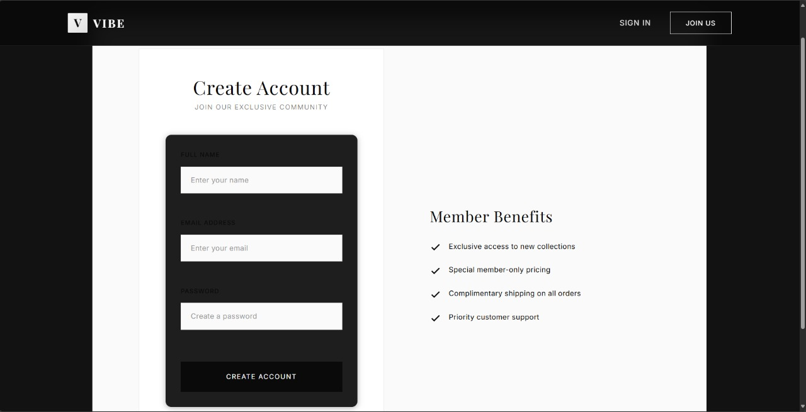
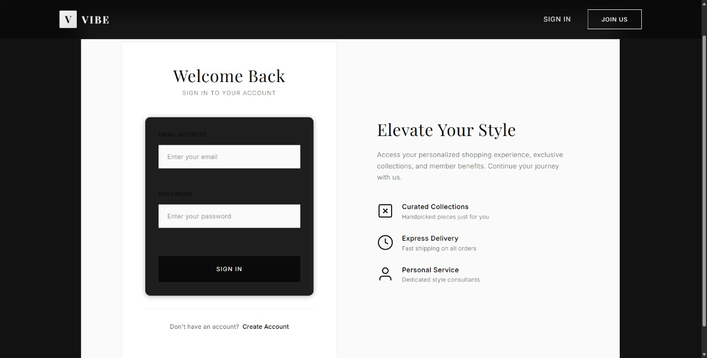
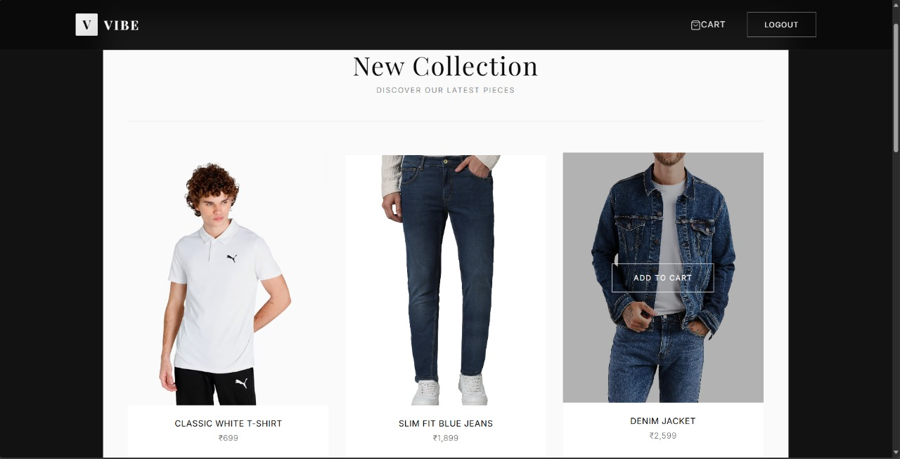
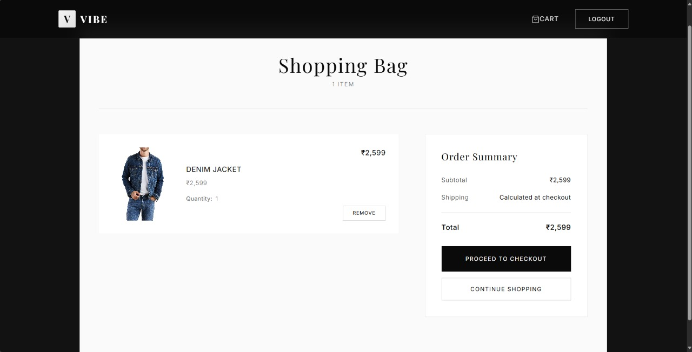
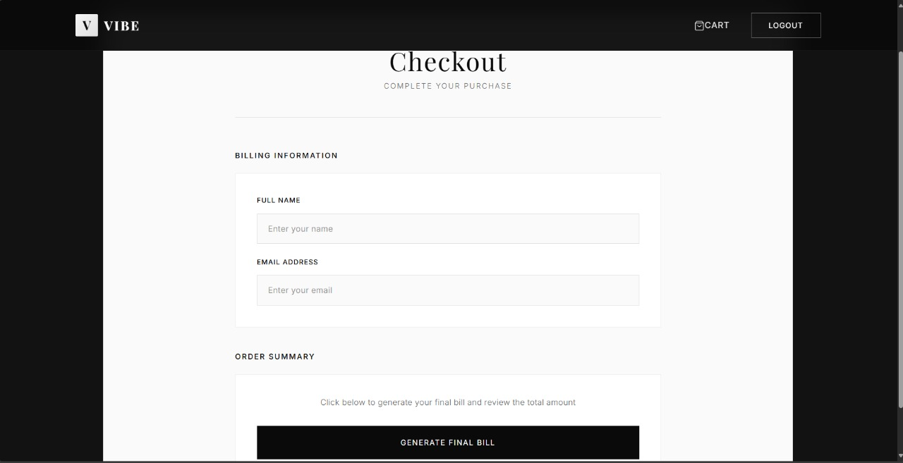
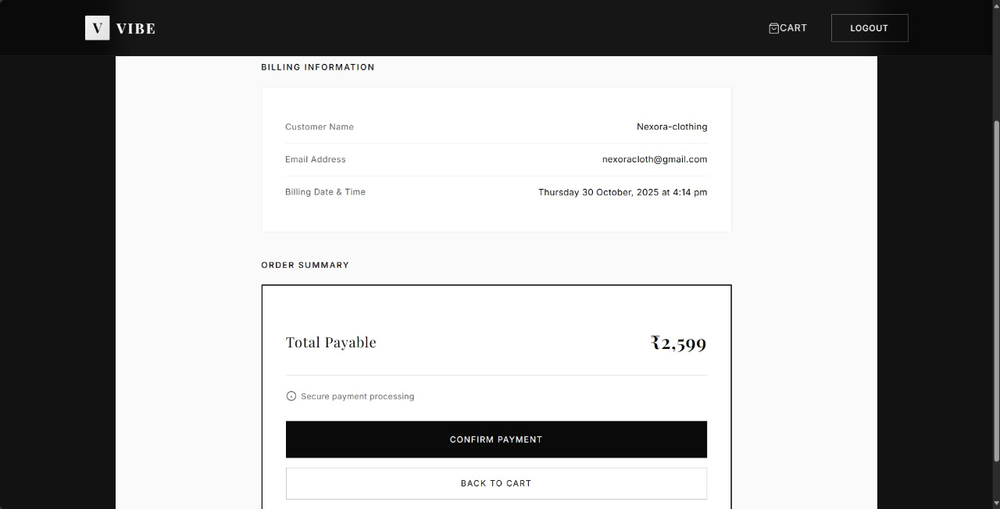

# 🛒 Mock E-Commerce Cart (MERN)

A simple full-stack **E-Commerce Cart Application** built with **MongoDB, Express, React, and Node.js**.  
Users can browse products, add them to a cart, and proceed to checkout to view their final bill and receipt.

---

## 🚀 Tech Stack

**Frontend:**
- React.js (Create React App)
- Axios (API calls)
- React Router (Navigation)

**Backend:**
- Node.js
- Express.js
- MongoDB (via Mongoose)
- JWT Authentication

---

## ⚙️ Setup Instructions

### 1️⃣ Clone the Repository
```bash
git clone https://github.com/your-username/mock-ecom-cart.git
cd mock-ecom-cart
```
2️⃣ Backend Setup
bash
```bash
cd backend-mongo
npm install
```
Create a .env file in the backend directory with:

```env

MONGO_URI=mongodb://127.0.0.1:27017/mock-ecom-cart
JWT_SECRET=your_jwt_secret_key_here
PORT=5000
```
3️⃣ Seed Mock Products
To insert 5–10 demo products into the database:


```bash
npm run seed
```
4️⃣ Start the Backend Server

```bash
npm start
Backend will run at http://localhost:5000
```
5️⃣ Frontend Setup

```bash
cd ../frontend
npm install
npm start
```
Frontend will run at http://localhost:3000

🧠 API Documentation
🟢 GET /api/products
Description: Fetch all mock products (5–10 items).
Response Example:

```json

[
  {
    "_id": "652f1a...d3b",
    "name": "Wireless Headphones",
    "price": 2499
  },
  {
    "_id": "652f1b...a1f",
    "name": "Bluetooth Speaker",
    "price": 1799
  }
]
```
🟡 POST /api/cart
Description: Add an item to the user’s cart.
Body Example:

```json

{
  "productId": "652f1ad3b...",
  "qty": 1
}
```
Response Example:

```json

{
  "_id": "652f2b...",
  "product": "652f1ad3b...",
  "user": "652f19...",
  "qty": 1
}
```
🔵 GET /api/cart
Description: Fetch all cart items of the logged-in user (with product details).
Response Example:

```json

[
  {
    "_id": "652f3a...",
    "product": {
      "name": "Wireless Mouse",
      "price": 899
    },
    "qty": 2,
    "user": {
      "name": "John Doe",
      "email": "john@example.com"
    }
  }
]
```
🔴 DELETE /api/cart/:id
Description: Remove a specific item from the cart.
Example:


```bash
DELETE /api/cart/652f3a...
```
Response:

```json

{ "message": "Item removed" }
```
🟣 POST /api/checkout
Description: Simulate checkout and generate a mock receipt.
Body Example:

```json
{
  "cartItems": [
    { "productId": "652f1ad3b...", "qty": 2 },
    { "productId": "652f1b1a2...", "qty": 1 }
  ]
}
```
Response Example:

```json

{
  "receipt": {
    "user": {
      "name": "John Doe",
      "email": "john@example.com"
    },
    "total": 5197,
    "timestamp": "2025-10-29T17:20:03.123Z"
  }
}
```
🧾 Billing Page Features
The Checkout page shows:

Logged-in user’s name and email

Current billing time

All cart items with quantities and totals

Final total amount

Success message after checkout

🔐 Authentication
Users must be logged in to:

Add items to cart

View their cart

Checkout

A valid JWT token is stored in localStorage and automatically sent with every API request.

🧩 Project Structure
```bash
root/
│
├── backend-mongo/
│   ├── config/
│   │   └── db.js
│   ├── middleware/
│   │   └── auth.js
│   ├── models/
│   │   ├── CartItem.js
│   │   ├── Order.js
│   │   ├── Product.js
│   │   └── User.js
│   ├── routes/
│   │   ├── auth.js
│   │   ├── cart.js
│   │   ├── checkout.js
│   │   └── products.js
│   ├── seed/
│   │   └── productsSeed.js
│   ├── server.js
│   └── .env
│
└── frontend/
    ├── src/
    │   ├── api/
    │   │   └── api.js
    │   ├── components/
    │   │   ├── Navbar.css
    │   │   ├── Navbar.jsx
    │   │   ├── ReceiptModal.jsx
    │   ├── pages/
    │   │   ├── Cart.jsx / Cart.css
    │   │   ├── Checkout.jsx / Checkout.css
    │   │   ├── Login.jsx / Login.css
    │   │   ├── Products.jsx / Products.css
    │   │   ├── Register.jsx / Register.css
    │   ├── App.jsx
    │   ├── index.js
    │   └── index.css
    └── package.json

```
📜 License
This project is licensed under the MIT License.

✨ Author
Abir Paul

B.Tech in IT, Techno Main Salt Lake

---

Register


Login


Products


Cart


Checkout


Billing

